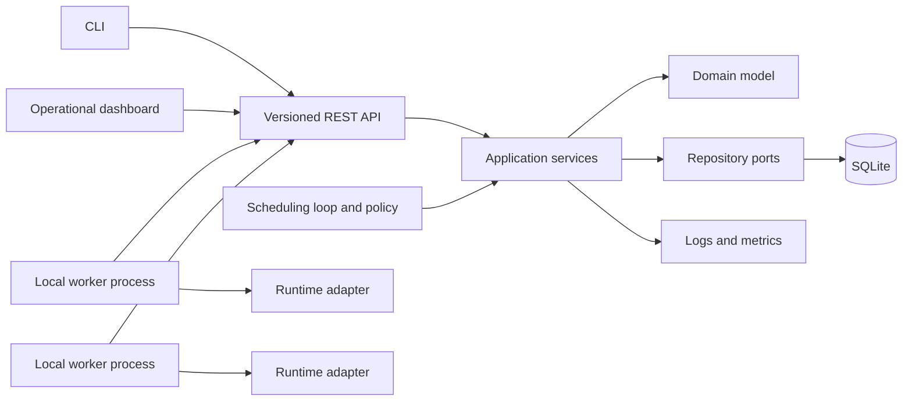

# V1 architecture

## Decision

Conductor V1 is a modular Python control plane with separate local worker processes. It uses one SQLite database and a bounded in-process scheduling loop. The dashboard and CLI are clients of the same versioned REST API.



The modular monolith is a deployment choice, not permission to couple modules. Domain and scheduling policy remain independent of FastAPI, SQLModel, runtime SDKs, and the dashboard.

## Ownership boundaries

| Module | Owns | Must not own |
| --- | --- | --- |
| `api` | HTTP routes, versioning, boundary validation, representation mapping | business rules, SQL queries, scheduler scoring |
| `core` | process bootstrap, application lifespan, shared error taxonomy | domain dumping ground or feature policy |
| `domain` | entities, value objects, invariants, legal transitions | frameworks, persistence mappings, runtime SDKs |
| `services` | use-case orchestration, transactions, authorization-free V1 commands | transport details or runtime-specific behavior |
| `scheduler` | eligibility, scoring, assignment policy, scheduling rationale | HTTP, SQL, process launching, inference |
| `workers` | worker registry, leases, epochs, capabilities, drain semantics | AI runtime implementations or job policy |
| `runtime` | runtime port and concrete load/invoke/unload adapters | job lifecycle or worker selection |
| `storage` | repository implementations, mappings, migrations, transactions | domain policy |
| `metrics` | measurements and exporters | state mutation or correctness decisions |
| `config` | typed settings, validation, environment overrides | mutable runtime state or secrets in source control |
| `models` | persistence/serialization shapes that are not domain entities | duplicated domain behavior |

## Runtime topology

- One control-plane process owns the API, application services, scheduling loop, and database connection management.
- One or more worker processes own runtime adapters and loaded model instances.
- Workers initiate registration, heartbeat, lease renewal, job polling, and result reporting through the control-plane API.
- A worker restart creates a new `epoch` for its stable configured identity. Messages from an older epoch are rejected.
- Workers may execute more than one job only when their declared slot capacity and runtime adapter permit it.

Worker-initiated communication avoids requiring routable inbound worker addresses and keeps a later remote-worker path possible without changing the domain model.

## Job request lifecycle

```mermaid
sequenceDiagram
    participant C as CLI or dashboard
    participant A as API
    participant J as Job service
    participant S as Scheduler
    participant W as Worker
    participant D as SQLite

    C->>A: Submit job with idempotency key
    A->>J: Submit validated command
    J->>D: Persist QUEUED job
    J-->>C: Job identity and status
    S->>D: Read schedulable jobs and worker snapshots
    S->>S: Filter, score, and explain
    S->>D: Atomically create attempt and assign job
    W->>A: Poll using worker identity and epoch
    A->>D: Lease assigned attempt
    W->>W: Ensure model ready; execute
    W->>A: Report guarded progress or terminal result
    A->>D: Commit attempt and job transition
```

## Correctness mechanisms

### Idempotency

- Job submission accepts a client-scoped idempotency key.
- Repeating the same key and canonical request returns the original job.
- Reusing a key with a different canonical request is rejected.
- Worker progress and terminal reports carry attempt identity, worker epoch, and monotonic attempt version.

### Leases and failure detection

- Registration grants a renewable worker lease with a configured expiry.
- Heartbeats report capacity and renew only the current worker epoch.
- Lease expiry marks the worker unreachable; it does not prove the process stopped.
- Attempts owned by an unreachable worker become `LOST` only after their execution lease expires.
- Retry creates a new attempt. A late result from an older attempt cannot overwrite it.

### Concurrency control

- Aggregate writes use optimistic versions and compare-and-set transitions.
- Scheduling assignment is one transaction: verify the job is queued, verify the worker snapshot is current, reserve capacity, create the attempt, and move the job to assigned.
- Only one active attempt is allowed per job.
- Terminal states are immutable.
- Cancellation and completion race through guarded transitions; the first valid committed terminal outcome wins.

### Queue recovery

The database query for non-terminal jobs is authoritative. An in-memory notification may wake the scheduling loop, but losing that notification cannot lose a job. On startup the scheduler reconstructs work from durable state.

## Scheduling boundary

The scheduling policy consumes an immutable snapshot and returns one of:

- `Placement(worker_id, score, factors)`;
- `Deferred(reason, failed_constraints)`.

Hard constraints run before scoring. Scores never make an ineligible worker eligible. Stable tie-breaking by worker identity makes identical inputs reproducible.

The first policy is intentionally heuristic, not machine-learned. A benchmark can later compare policies using recorded scheduling inputs without coupling the control plane to one implementation.

## Data boundaries

- SQLite stores metadata, state transitions, configuration references, and result metadata.
- Large request inputs, model artifacts, and large outputs are referenced by validated local artifact handles; they are not stored as database blobs.
- Secrets, arbitrary host paths, and raw model binaries never appear in API list responses or structured logs.

## Observability boundary

Structured logs contain correlation fields including `job_id`, `attempt_id`, `worker_id`, and `model_id` where applicable. Metrics describe aggregate behavior; logs and persisted scheduling decisions explain individual behavior. Neither is a source of truth for state recovery.

## Security posture for local V1

Conductor binds to loopback by default. It does not execute arbitrary shell commands, accept arbitrary runtime imports, or expose unrestricted host paths. Runtime adapters and model definitions come from trusted local configuration. Authentication is excluded only while the product remains loopback-only and single-user.
