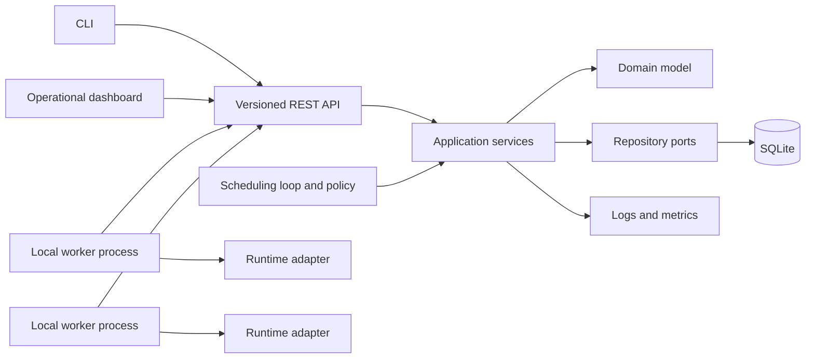

# V1 architecture

## Architecture in one minute

Think of Conductor as a small delivery company:

- the **API** is the reception desk that accepts delivery requests;
- a **job** is the durable delivery order;
- the **scheduler** chooses which driver should receive the order;
- a **worker** is a driver that performs the delivery;
- an **execution attempt** records one specific try;
- SQLite is the company record book that survives an office restart.

The control plane coordinates work. It does not contain model-specific inference
logic. The current worker-facing execution path calls the fixture or Ollama
adapter through `RuntimeManager`; an ONNX adapter remains planned.

This separation matters because coordination and inference have different responsibilities. The control plane must stay responsive even when a model takes several seconds to load or a worker crashes.

## Decision

Conductor V1 is a modular Python control plane with separate local worker processes. It uses one SQLite database and a bounded in-process scheduling loop. The dashboard and CLI are clients of the same versioned REST API.

### What “modular monolith” means

“Monolith” means the control-plane modules run as one deployed backend application. “Modular” means the code still has strict internal boundaries.

```text
One operating-system process
┌───────────────────────────────────────────┐
│ API → services → domain/scheduler → ports │
│                              ↓            │
│                         SQLite storage    │
└───────────────────────────────────────────┘
```

This is a deliberate V1 choice:

- starting the project requires one backend process rather than many services;
- a job assignment can use one local database transaction;
- debugging is easier because one request is not crossing several network services;
- module boundaries still allow a component to be extracted later if measurement proves it is necessary.

The trade-off is that modules share one process. A CPU-heavy operation inside the control plane could affect the whole API, which is one reason AI inference belongs in worker processes.



The modular monolith is a deployment choice, not permission to couple modules. Domain and scheduling policy remain independent of FastAPI, SQLModel, runtime SDKs, and the dashboard.

## Ownership boundaries

| Module | Owns | Must not own |
| --- | --- | --- |
| `api` | HTTP routes, versioning, boundary validation, representation mapping | business rules, SQL queries, scheduler scoring |
| `core` | process bootstrap, application lifespan, shared error taxonomy | domain dumping ground or feature policy |
| `domain` | entities, value objects, invariants, legal transitions | frameworks, persistence mappings, runtime SDKs |
| `services` | use-case orchestration, transactions, authorization-free V1 commands | transport details or runtime-specific behavior |
| `scheduler` | eligibility, scoring, assignment policy, scheduling rationale | HTTP, SQL, process launching, inference |
| `workers` | worker registry, leases, epochs, capabilities, drain semantics | AI runtime implementations or job policy |
| `runtime` | runtime port and concrete load/invoke/unload adapters | job lifecycle or worker selection |
| `storage` | repository implementations, mappings, migrations, transactions | domain policy |
| `metrics` | measurements and exporters | state mutation or correctness decisions |
| `config` | typed settings, validation, environment overrides | mutable runtime state or secrets in source control |
| `models` | persistence/serialization shapes that are not domain entities | duplicated domain behavior |

### Why boundaries matter: one example

Suppose we decide that a draining worker cannot receive a new job.

- `api/` validates the request and returns HTTP.
- `services/` asks for current workers and coordinates the transaction.
- `scheduler/` contains the rule that a draining worker is ineligible.
- `storage/` persists the decision.

If that rule lived directly in a FastAPI route, a future CLI path might accidentally bypass it. Keeping the rule in the scheduler makes every caller use the same behavior.

## Runtime topology

- One control-plane process owns the API, application services, scheduling loop, and database connection management.
- The current standalone worker process owns registration, heartbeat, job polling,
  graceful drain, and local CPU/RAM reports. A later phase will move runtime
  adapters and loaded model instances into that process.
- Workers initiate communication through the control-plane API. Today they lease
  and start jobs, then call `/execute`; the control plane still invokes the
  runtime adapter and persists the result.
- A worker restart creates a new `worker_instance_id` for its stable configured identity. This is the same idea sometimes called an “epoch.” Messages from an older process instance are rejected.
- Workers may execute more than one job only when their declared slot capacity and runtime adapter permit it.

Worker-initiated communication avoids requiring routable inbound worker addresses and keeps a later remote-worker path possible without changing the domain model.

### Why workers poll instead of receiving pushed work

With polling, workers initiate the connection:

```text
Worker → “Do you have work for me?” → Control plane
```

The alternative is for the control plane to call each worker. That requires the control plane to know a reachable address for every worker and handle firewalls, ports, and worker restarts.

Polling is simpler for a local-first system. Its cost is a small delay between a job arriving and the next poll. We can tune the polling interval or add a notification mechanism later without changing job correctness.

## Job request lifecycle

```mermaid
sequenceDiagram
    participant C as CLI or dashboard
    participant A as API
    participant J as Job service
    participant S as Scheduler
    participant W as Worker
    participant D as SQLite

    C->>A: Submit job with idempotency key
    A->>J: Submit validated command
    J->>D: Persist QUEUED job
    J-->>C: Job identity and status
    S->>D: Read schedulable jobs and worker snapshots
    S->>S: Filter, score, and explain
    S->>D: Atomically create attempt and assign job
    W->>A: Poll using worker ID and process-instance ID
    A->>D: Lease assigned attempt
    W->>W: Ensure model ready; execute
    W->>A: Report guarded progress or terminal result
    A->>D: Commit attempt and job transition
```

## Correctness mechanisms

Correctness mechanisms are protections against “works most of the time” bugs. These bugs appear when requests are repeated, workers restart, or two operations happen nearly simultaneously.

### Idempotency

- Job submission accepts a client-scoped idempotency key.
- Repeating the same key and canonical request returns the original job.
- Reusing a key with a different canonical request is rejected.
- Worker progress and terminal reports carry attempt identity, process-instance ID, and monotonic attempt version.

Example:

```text
12:00:00 client submits key=abc
12:00:01 server stores job J1, but the response is lost
12:00:03 client retries key=abc
12:00:03 server returns J1 instead of creating J2
```

Without idempotency, an ordinary network timeout could create duplicate expensive inference work.

### Leases and failure detection

- Registration grants a renewable worker lease with a configured expiry.
- Heartbeats report capacity and renew only the current worker process instance.
- Lease expiry marks the worker unreachable; it does not prove the process stopped.
- Attempts owned by an unreachable worker become `LOST` only after their execution lease expires.
- Retry creates a new attempt. A late result from an older attempt cannot overwrite it.

A lease is temporary ownership, similar to borrowing a meeting room for a fixed period. If the lease expires, Conductor may give the job to another worker. The first worker might still be running, so a late result must be rejected rather than blindly accepted.

### Concurrency control

- Aggregate writes use optimistic versions and compare-and-set transitions.
- Scheduling assignment is one transaction: verify the job is queued, verify the worker snapshot is current, reserve capacity, create the attempt, and move the job to assigned.
- Only one active attempt is allowed per job.
- Terminal states are immutable.
- Cancellation and completion race through guarded transitions; the first valid committed terminal outcome wins.

Example with optimistic versions:

```text
Database contains job version 4

Scheduler reads version 4 ── tries to assign
User reads version 4 ─────── tries to cancel

First committed update changes version 4 → 5
Second update expects version 4 and is rejected
```

This prevents the second writer from silently overwriting the first writer’s newer decision.

### Queue recovery

The database query for non-terminal jobs is authoritative. An in-memory notification may wake the scheduling loop, but losing that notification cannot lose a job. On startup the scheduler reconstructs work from durable state.

## Scheduling boundary

The scheduling policy consumes an immutable snapshot and returns one of:

- `Placement(worker_id, score, factors)`;
- `Deferred(reason, failed_constraints)`.

Hard constraints run before scoring. Scores never make an ineligible worker eligible. Stable tie-breaking by worker identity makes identical inputs reproducible.

The first policy is intentionally heuristic, not machine-learned. A benchmark can later compare policies using recorded scheduling inputs without coupling the control plane to one implementation.

### Policy versus mechanism

- **Policy** answers: “Which worker should win?”
- **Mechanism** answers: “How do we read workers, save the attempt, and commit the transaction?”

`scheduler/policy.py` owns policy. `services/workers.py` owns the mechanism around it.

Separating them lets us test scheduling with plain Python objects. A test does not need to start FastAPI or create SQLite tables just to prove that a full worker is ineligible.

## Data boundaries

- SQLite stores metadata, state transitions, configuration references, and result metadata.
- Large request inputs, model artifacts, and large outputs are referenced by validated local artifact handles; they are not stored as database blobs.
- Secrets, arbitrary host paths, and raw model binaries never appear in API list responses or structured logs.

## Observability boundary

Structured logs contain correlation fields including `job_id`, `attempt_id`, `worker_id`, and `model_id` where applicable. Metrics describe aggregate behavior; logs and persisted scheduling decisions explain individual behavior. Neither is a source of truth for state recovery.

## Security posture for local V1

Conductor binds to loopback by default. It does not execute arbitrary shell commands, accept arbitrary runtime imports, or expose unrestricted host paths. Runtime adapters and model definitions come from trusted local configuration. Authentication is excluded only while the product remains loopback-only and single-user.

## What happens when something fails?

| Failure | Desired behavior |
| --- | --- |
| API restarts | Jobs remain in SQLite and can be recovered |
| Client retries submission | Same idempotency key returns the original job |
| Worker restarts | New process-instance ID replaces the old one |
| Old worker sends a late result | Control plane rejects the stale process or attempt |
| All workers are full | Job stays queued and the reason is recorded |
| Two workers try to claim one job | Optimistic version check allows only one assignment |

## Questions to check your understanding

1. Why is inference executed in workers instead of inside the FastAPI request?
2. What simplicity do we gain from a modular monolith?
3. Why is SQLite, rather than an in-memory queue, the recovery source of truth?
4. What bug does `worker_instance_id` prevent?
5. Why must attempt creation and job assignment share one transaction?
