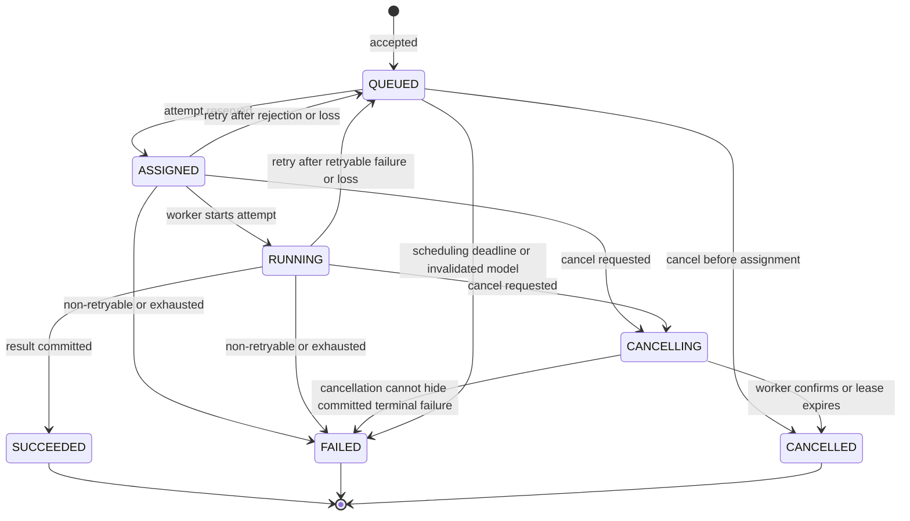
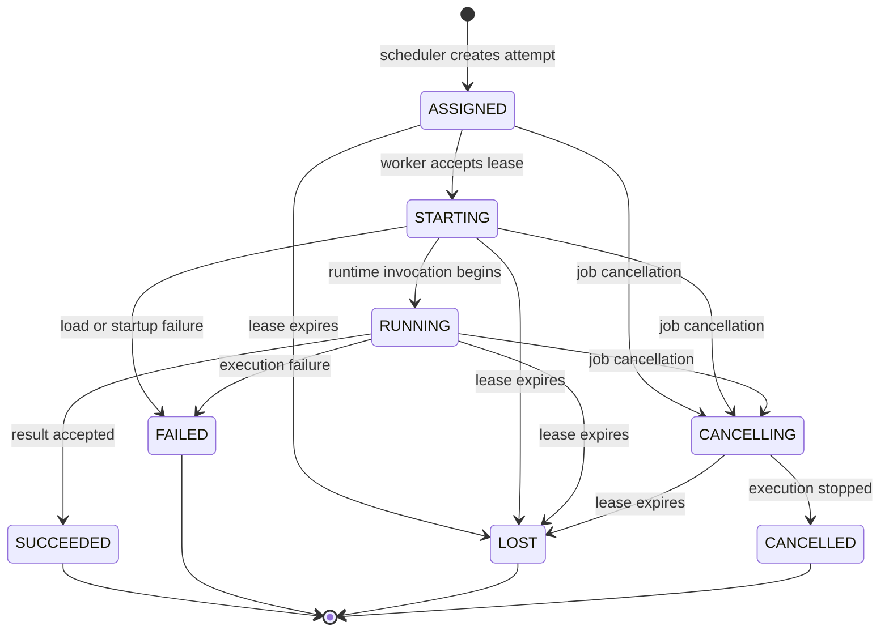
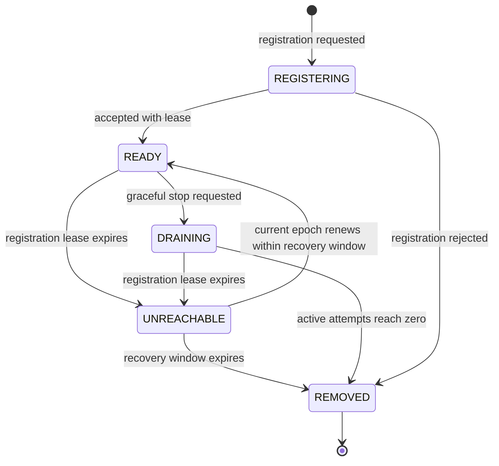
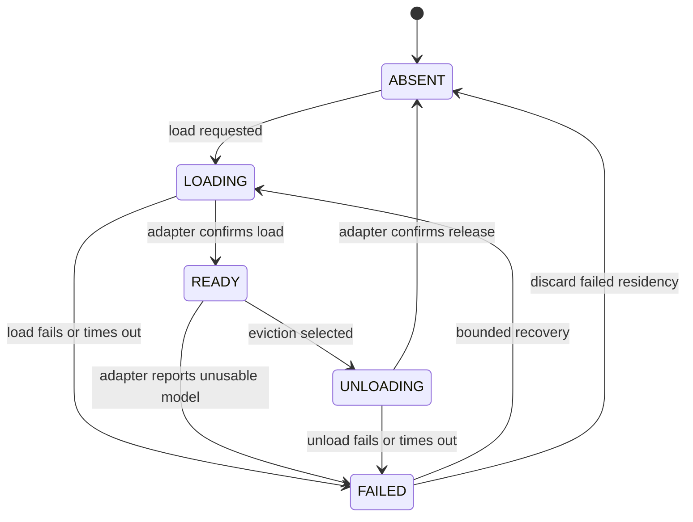

# State machines

These transitions are normative for V1. Implementations must reject transitions not listed here and must persist transitions using optimistic concurrency guards.

## Job lifecycle

Rules:

- `QUEUED` is the only schedulable state.
- Assignment and attempt creation are one transaction.
- A retry closes the previous attempt before returning the job to `QUEUED`.
- `CANCELLING` stops new retries and records intent while cooperative cancellation completes.
- A running success racing with cancellation may commit only through a version guard. If success commits first, cancellation observes a terminal job; once `CANCELLING` commits first, a later success is rejected.
- `SUCCEEDED`, `FAILED`, and `CANCELLED` are immutable.

## Execution-attempt lifecycle

Rules:

- Attempt status is historical; a retry always receives a new attempt identity.
- `LOST` means exclusive ownership expired, not that the worker definitely stopped.
- Reports from terminal or superseded attempts are acknowledged as stale and cannot mutate their job.
- Result persistence and transition to `SUCCEEDED` occur atomically from the control plane's perspective.

## Worker-registration lifecycle

Rules:

- A process restart registers a new epoch; it does not revive its old attempt leases.
- `READY` means eligible for evaluation, not guaranteed schedulable capacity.
- `DRAINING` and `UNREACHABLE` workers receive no new work.
- Busy and idle are derived from reserved slots, not lifecycle states.
- Late heartbeats from a non-current epoch are rejected.

## Model-residency lifecycle

Rules:

- `ABSENT` is a conceptual state; persisted residency may be deleted after audit retention.
- Model use is permitted only in `READY` on the current worker epoch.
- A residency with an active execution count greater than zero cannot enter `UNLOADING`.
- Busy and idle are derived from active execution count and last-used time.
- Worker epoch loss invalidates all of that epoch's residencies regardless of their last reported state.

## Scheduling decision lifecycle

Scheduling decisions are immutable facts rather than mutable state machines. Each scheduling evaluation records either assignment or deferral. A later evaluation produces a new decision record using a new snapshot and policy version.

## Failure categories

V1 uses stable categories so retry behavior is deterministic:

| Category | Default retry | Example |
| --- | --- | --- |
| `INVALID_REQUEST` | No | Unsupported task parameters |
| `MODEL_UNAVAILABLE` | Conditional | Disabled or missing definition |
| `INSUFFICIENT_CAPACITY` | Defer, not attempt failure | No eligible memory headroom |
| `WORKER_LOST` | Yes | Execution lease expired |
| `MODEL_LOAD_FAILED` | Bounded | Runtime load error |
| `EXECUTION_TIMEOUT` | Bounded | Adapter deadline exceeded |
| `RUNTIME_ERROR` | Bounded | Transient inference failure |
| `RESULT_REJECTED` | No | Invalid or oversized result |
| `CANCELLED_BY_USER` | No | Explicit cancellation |
| `INTERNAL_ERROR` | Bounded and alerted | Unexpected control-plane failure |

Retryability stored on an individual failure is decided from the category plus current policy; it is not trusted from worker-provided input.
