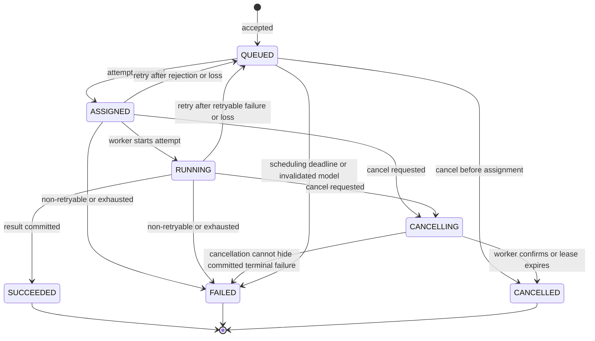
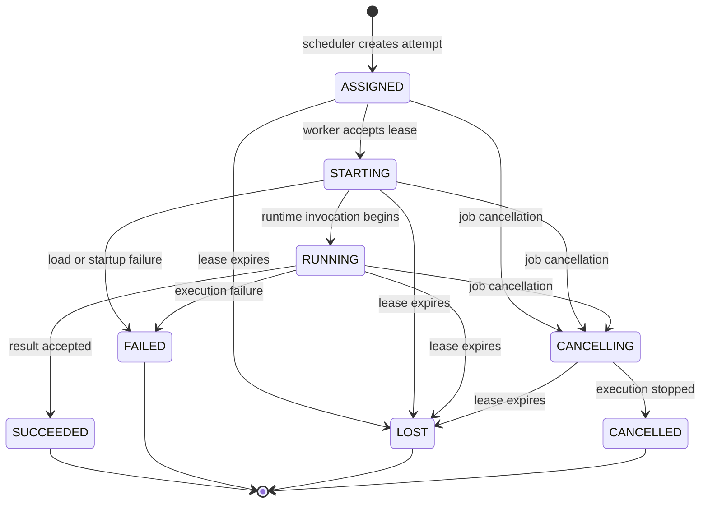
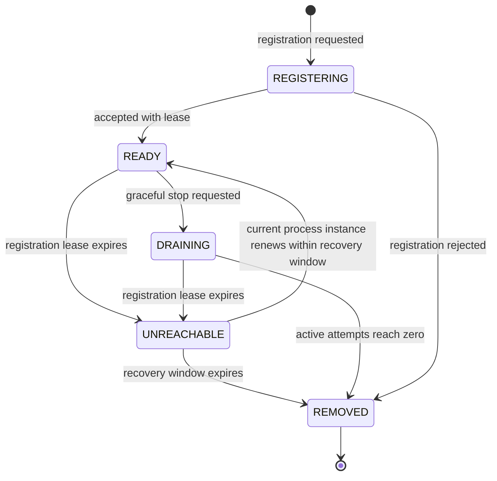
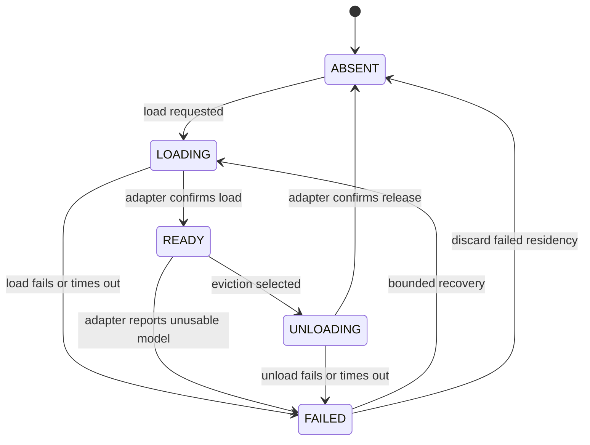

# State machines

These transitions are the target V1 contract. Several core transitions are already
implemented and tested, while retries, lease expiry, and running-job cancellation
remain planned. See [`current-capabilities.md`](current-capabilities.md) for the
current boundary before assuming a diagram is executable today.

## What a state machine is

A state machine is a list of:

1. possible states;
2. legal movements between states;
3. rules that guard those movements.

Consider an online order. It makes sense to move from `placed` to `shipped`. It does not make sense to move from `delivered` back to `placed`.

Conductor uses the same idea. A job cannot report success before a worker has started it. Writing allowed transitions down prevents different parts of the codebase from inventing contradictory behavior.

## How state-machine rules appear in code

Domain methods enforce transitions:

```python
running_job.succeed()   # valid: returns a new SUCCEEDED job
queued_job.succeed()    # invalid: raises InvalidStateTransition
```

The object is immutable, so the method returns a new object with a higher version. The repository then updates the database only if the old version still matches.

## Job lifecycle



Rules:

- `QUEUED` is the only schedulable state.
- Assignment and attempt creation are one transaction.
- A retry closes the previous attempt before returning the job to `QUEUED`.
- `CANCELLING` stops new retries and records intent while cooperative cancellation completes.
- A running success racing with cancellation may commit only through a version guard. If success commits first, cancellation observes a terminal job; once `CANCELLING` commits first, a later success is rejected.
- `SUCCEEDED`, `FAILED`, and `CANCELLED` are immutable.

### Example: normal success

```text
QUEUED
  ↓ scheduler creates attempt
ASSIGNED
  ↓ worker confirms runtime start
RUNNING
  ↓ result is accepted
SUCCEEDED
```

### Example: why terminal states cannot change

Suppose a job succeeds and its result is returned to a client. Changing it to `failed` later would make the earlier response untrustworthy. Terminal states are final facts.

### Example: cancellation racing with success

Two requests may happen nearly together:

```text
Worker: “Job succeeded”
User:   “Cancel the job”
```

Both read the same version. The first valid database update wins and increments the version. The other update fails its version check and must reread the final state. This gives one unambiguous outcome.

## Execution-attempt lifecycle



Rules:

- Attempt status is historical; a retry always receives a new attempt identity.
- `LOST` means exclusive ownership expired, not that the worker definitely stopped.
- Reports from terminal or superseded attempts are acknowledged as stale and cannot mutate their job.
- Result persistence and transition to `SUCCEEDED` occur atomically from the control plane's perspective.

### Why attempts have their own state

A job may be retried, so job status alone cannot preserve each try:

```text
Job J1: SUCCEEDED
Attempt A1: LOST
Attempt A2: SUCCEEDED
```

This history helps explain reliability behavior and prevents a late message from A1 from modifying the result produced by A2.

`LOST` does not mean the process definitely stopped. It means Conductor no longer trusts that attempt’s ownership. The worker could be slow, disconnected, or dead; the safe action is the same.

## Worker-registration lifecycle



Rules:

- A process restart registers a new `worker_instance_id`; it does not revive its old attempt leases.
- `READY` means eligible for evaluation, not guaranteed schedulable capacity.
- `DRAINING` and `UNREACHABLE` workers receive no new work.
- Busy and idle are derived from reserved slots, not lifecycle states.
- Late heartbeats from a non-current process instance are rejected.

### Ready is not the same as available

A ready worker is healthy enough to be considered. It may still have no free slots:

```text
status: READY
active slots: 2
maximum slots: 2
derived availability: FULL
```

We do not add a separate `BUSY` state because it could disagree with the slot count. Busy/full is calculated from capacity.

## Model-residency lifecycle



Rules:

- `ABSENT` is a conceptual state; persisted residency may be deleted after audit retention.
- Model use is permitted only in `READY` on the current worker process instance.
- A residency with an active execution count greater than zero cannot enter `UNLOADING`.
- Busy and idle are derived from active execution count and last-used time.
- Losing a worker process instance invalidates all of that instance’s residencies regardless of their last reported state.

### Why model loading has states

Loading a model is not instantaneous. Another request arriving during `LOADING` must wait or share the same load operation; it must not assume the model is already ready.

Similarly, a model cannot be unloaded while an execution is using it. The residency state machine gives one place to enforce that rule.

## Scheduling decision lifecycle

Scheduling decisions are immutable facts rather than mutable state machines. Each scheduling evaluation records either assignment or deferral. A later evaluation produces a new decision record using a new snapshot and policy version.

Example:

```text
10:00 decision D1 → deferred because every worker is full
10:01 worker-a completes a job
10:02 decision D2 → assigned to worker-a
```

D2 does not update D1. Both are useful history: D1 explains why the job waited, and D2 explains why it later ran.

## Failure categories

V1 uses stable categories so retry behavior is deterministic:

| Category | Default retry | Example |
| --- | --- | --- |
| `INVALID_REQUEST` | No | Unsupported task parameters |
| `MODEL_UNAVAILABLE` | Conditional | Disabled or missing definition |
| `INSUFFICIENT_CAPACITY` | Defer, not attempt failure | No eligible memory headroom |
| `WORKER_LOST` | Yes | Execution lease expired |
| `MODEL_LOAD_FAILED` | Bounded | Runtime load error |
| `EXECUTION_TIMEOUT` | Bounded | Adapter deadline exceeded |
| `RUNTIME_ERROR` | Bounded | Transient inference failure |
| `RESULT_REJECTED` | No | Invalid or oversized result |
| `CANCELLED_BY_USER` | No | Explicit cancellation |
| `INTERNAL_ERROR` | Bounded and alerted | Unexpected control-plane failure |

Retryability stored on an individual failure is decided from the category plus current policy; it is not trusted from worker-provided input.

## Why invalid transitions are rejected instead of ignored

Silently accepting an invalid transition hides bugs. If a worker reports success for an attempt that is still merely `ASSIGNED`, Conductor should expose the protocol error rather than manufacture a believable but incorrect history.

Rejecting invalid transitions makes failures visible during tests and prevents corrupted production state.

## Questions to check your understanding

1. Why can only queued jobs be scheduled?
2. Why is `LOST` different from `FAILED`?
3. Why is `BUSY` not a worker lifecycle state?
4. What happens when cancellation and success race?
5. Why do scheduling decisions form history rather than one mutable record?
